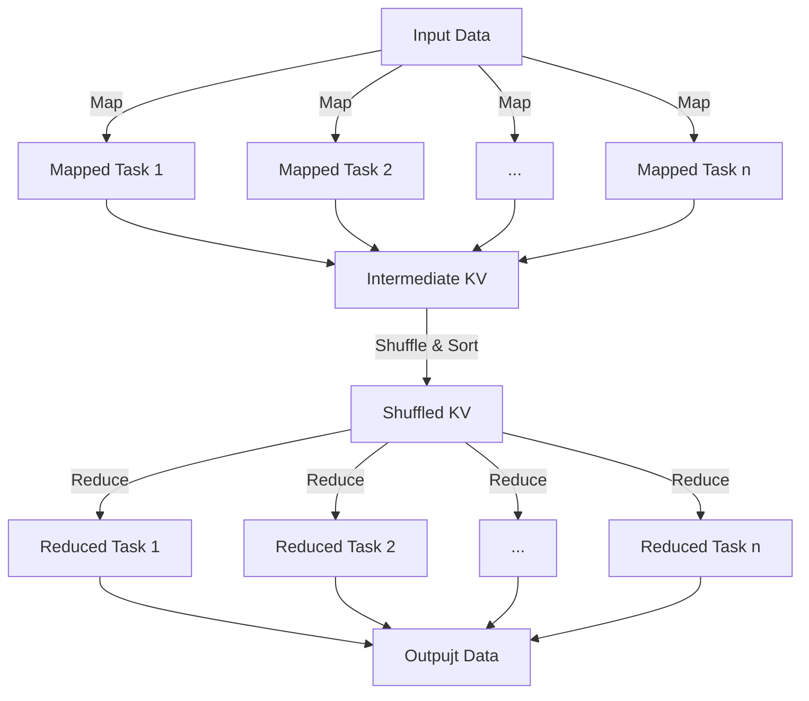

# MiniMapReduce

A lightweight, Java-based MapReduce framework designed to demonstrate the core concepts of distributed data processing.
MiniMapReduce lets you run simple MapReduce jobs, such as word counts or data aggregations, on a single JVM using
parallelism via the ForkJoinPool.

## Table of Contents

- [Key Features](#key-features)
- [Prerequisites](#prerequisites)
- [How It Works](#how-it-works)
- [License](#license)

## Key Features

- **Core MapReduce API**
  Provides [`Mapper`](/src/core/Mapper.java), [`Reducer`](/src/core/Reducer.java), and [`Job`](/src/jobs) abstractions
  that mirror the classic MapReduce paradigm.
- **Parallel Processing**
  Utilizes Java’s `ForkJoinPool` to process map tasks concurrently for high throughput on multi-core machines.
- **Pluggable Tasks**
  Easily swap in your own mapper and reducer implementations to tackle custom data-processing jobs.
- **Lightweight & Portable**
  No external dependencies beyond JDK 24 and JUnit 4, runs anywhere Java runs.

## Prerequisites

- **Java Development Kit (JDK) 24**
- **JUnit 4** (for unit and integration tests)

## How It Works

1. **Map Phase**

   - Input splits are read line-by-line.
   - Each line is submitted as a `Mapped Task` to the `ForkJoinPool`.
   - The user-provided [`Mapper`](/src/core/Mapper.java) processes input and emits intermediate key–value pairs.

2. **Shuffle & Sort**

   - Intermediate pairs from all map tasks are grouped by key.
   - Data is partitioned evenly among the specified number of reducers.

3. **Reduce Phase**

   - Each partition is handled by a `Reduced Task` in parallel.
   - The user-provided [`Reducer`](/src/core/Reducer.java) combines all values for a key into final results.

4. **Output**

   - Final key–value pairs are written to output, one per reducer.

## License

This project is licensed under the MIT License. See [LICENSE](LICENSE) for details.
